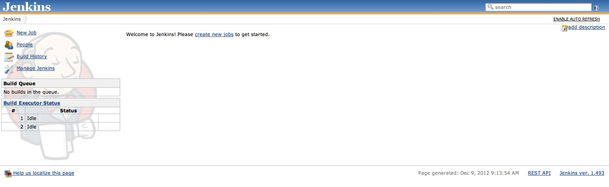

{{ page.title }}
================

<p class="meta">9 Dec 2012</p>

## Overview

**In part 1 of Chef Testing, we went over the prereqs of what is needed to get basic testing inplace. In this post we'll setup Our first jenkins job and setup food critic. **

## Step 1 - Setting up the Foundation!

** Let's begin by getting jenkins installed! **

Head over to <http://jenkins-ci.org/> and download the installer for your platform, I'm using the Mac OS X installer for this example. If your setting up on a Mac, here is the installation doc that I'm following: <http://goodliffe.blogspot.com/2011/09/how-to-set-up-jenkins-ci-on-mac.html>.

Now that I have Jenkins installed, here is what the default dashboard looks like. 



Now, let's get the plugins and parsers that we need installed and setup. 

Head over to the plugin manager and install the following plugins, For Jenkins installed on a Mac OS X, visit <http://localhost:8080/pluginManager/available>. 

#### Jenkins Plugins

1. MultiJob Plugin - <http://wiki.jenkins-ci.org/display/JENKINS/Multijob+Plugin>
2. Hudson Ruby Plugin - <http://wiki.hudson-ci.org/display/HUDSON/Ruby+Plugin>
3. ScriptTrigger - <http://wiki.jenkins-ci.org/display/JENKINS/ScriptTrigger+Plugin>
4. Dashboard View - <http://wiki.jenkins-ci.org/display/JENKINS/Dashboard+View>
5. Warning Plugin - <http://wiki.jenkins-ci.org/x/G4CGAQ>
6. Analysis Collector Plugin - <http://wiki.jenkins-ci.org/x/tgeIAg>
7. GroovyAxis - <http://jenkins-ci.org/plugin/groovyaxis/>
8. Git Plugin - <http://wiki.jenkins-ci.org/display/JENKINS/Git+Plugin>
9. Github Plugin - <http://wiki.jenkins-ci.org/display/JENKINS/Github+Plugin>
10. Jenkins Ruby Metrics - <http://wiki.jenkins-ci.org/display/JENKINS/Ruby+Metrics+Plugin>
11. Environment Injector - <https://wiki.jenkins-ci.org/display/JENKINS/EnvInject+Plugin>
12. Environment Script Plugin - <http://wiki.jenkins-ci.org/display/JENKINS/Environment+Script+Plugin>
13. Build Pipeline Plugin - <https://code.google.com/p/build-pipeline-plugin>
14. Jenkins Adaptive Plugin - <http://wiki.jenkins-ci.org/display/JENKINS/Jenkins+Adaptive+Plugin>
15. Dynamic Axis - <https://wiki.jenkins-ci.org/display/JENKINS/DynamicAxis+Plugin>
16. Green Balls - <http://wiki.jenkins-ci.org/display/JENKINS/Green+Balls>

## Step 2 - Compile Warnings 
For Jenkins Mac, visit <http://localhost:8080/configure>


Next… Head over to the configure screen so we can add some parser warnings. Scroll down till you see **Compiler Warnings**.

##### FoodCritic - More Info <http://acrmp.github.com/foodcritic/#ci>
*Enter the field as follows:*

Name -  Foodcritic

Link name - Foodcritic recipe check results

Trend Report Name - Foodcritic Warnings

Regular Expression - `^(FC[0-9]+): (.*): ([^:]+):([0-9]+)$`

Mapping Script

```
import hudson.plugins.warnings.parser.Warning

String fileName = matcher.group(3)
String lineNumber = matcher.group(4)
String category = matcher.group(1)
String message = matcher.group(2)

return new Warning(fileName, Integer.parseInt(lineNumber), "Foodcritic Warning", category, message);
```
Example Log Message 

```FC001: Use strings in preference to symbols to access node attributes: ./recipes/innostore.rb:30``` 

You should get something like below as your output.

```
One warning found
file name: ./recipes/innostore.rb
line number: 30
priority: Normal Priority
category:  FC001
type: Foodcritic Warning
message: Use strings in prefe[...]ols to access node attributes

```
Add another Compiler warning #2 

#### Ruby Syntax Warning 

Name - Ruby Syntax Warnings

Link Name - Ruby syntax check results

Trend Report Name - Ruby syntax warnings

Regular Expression - `^Checking syntax of .+\n(.+):(\d+):(.*)$`

Mapping Script -

```
import hudson.plugins.warnings.parser.Warning

String fileName = matcher.group(1)
String lineNumber = matcher.group(2)
String category = "warn"
String message = matcher.group(3)

return new Warning(fileName, Integer.parseInt(lineNumber), "Ruby Syntax Warning", category, message);

```

Example Log Message - 

```
Checking syntax of ./cookbooks/cobbler/recipes/default.rb
./cookbooks/cobbler/recipes/default.rb:61: syntax error, unexpected ')'

```

Expected Output:

```
One warning found
file name: ./cookbooks/cobbler/recipes/default.rb
line number: 61
priority: Normal Priority
category:  warn
type: Ruby Syntax Warning
message: syntax error, unexpected ')'

```

#### Chef Run Warning 

Name - Chef Run

Link Name - Chef Run Warning Report

Trend Report Name - Chef Run warnings and errors

Regular Expression - `^\[.+\] (.+): (.+) \(/srv/chef/file_store/(.+)\:(\d+).+\s(.+)`

Mapping Script - 

```

import hudson.plugins.warnings.parser.Warning
import hudson.plugins.analysis.util.model.Priority

String category = matcher.group(1)
String message = matcher.group(5)
String fileName = matcher.group(3)
String lineNumber = matcher.group(4)
Priority priority = Priority.LOW

        if ("FATAL".equalsIgnoreCase(category) || "ERROR".equalsIgnoreCase(category)) {
           priority = Priority.HIGH
        }
        else { priority = Priority.NORMAL }


return new Warning(fileName, Integer.parseInt(lineNumber), "Chef Run Warning", category, message, priority);

```

Example Message Log - 

```

[Fri, 08 Jan 2011 18:55:53 -0400] ERROR: execute[temp_1 and temp_2 copy to root] (/srv/chef/file_store/cookbooks/logrotate/recipes/default.rb:82:in `from_file') had an error:
execute[drush and drush_make copy to root] (logrotate::default line 82) had an error: Expected process to exit with [0], but received '1'

```

Expected Output:

```
One warning found
file name: cookbooks/logrotate/recipes/default.rb
line number: 82
priority: High Priority
category:  ERROR
type: Chef Run Warning
message: execute[temp and tem[…]it with [0], but received '1'

```

#### Knife Run Warning 

Name - Knife Run

Link Name - Knife Run report

Trend Report Name - Knife Run warnings

Regular Expression - `(.+): (.+):(\d+): (.+)`

Mapping Script -

```
import hudson.plugins.warnings.parser.Warning
import hudson.plugins.analysis.util.model.Priority;

String fileName = matcher.group(2)
String lineNumber = matcher.group(3)
String category = matcher.group(1)
String message = matcher.group(4)
Priority priority;

        if ("FATAL".equalsIgnoreCase(category)) {
           priority = Priority.HIGH
        }
        else { priority = Priority.NORMAL }

return new Warning(fileName, Integer.parseInt(lineNumber), "Knife Run warning", category, message, priority);

```

Example Log Message -

```
FATAL: /Users/Shared/Jenkins/Home/jobs/chef-test-spiceweasel-update/workspace/cookbooks/ntp/recipes/default.rb:7: syntax error, unexpected kDO, expecting $end

```

Expected Output:

```
One warning found
file name: /Users/Shared/Jenk[...]tform/recipes/default.rb
line number: 2
priority: High Priority
category:  FATAL
type: Knife Run warning
message: syntax error, unexpected kDO, expecting $end

```

#### Chef Message Warning 

Name - Chef Run Message (no line number)

Link Name - Chef run messages

Trend Report Name - Knife Run warnings

Regular Expression - `^\[.+\] (.+?): (.+)`


## Step 3 - Validate Repository Job


Let's get the first job setup, the first job will clone our Chef repo from github and perform a ruby syntax check, foodcritic cookbook check then start the second job if the build passes. The Public key for our jenkins user will have to be added to your github ssh keys in your Github profile so it may checkout the github repo. 

On linux systems, you can find Jenkins public key in `/var/lib/jenkins/.ssh` directory. If your using the Mac OS X installer, by default the Jenkins home directory is `/Users/Shared/Jenkins/Home`, the public key file is `/Users/Shared/Jenkins/Home/identity.key`. This directory is owned by the jenkins user, so be sure to `sudo su jenkins`. 


Execute Shell 1:
<script src="https://gist.github.com/4242705.js?file=gistfile1.txt"></script>

Execute Shell 2:
<script src="https://gist.github.com/4246285.js?file=gistfile1.txt"></script>


